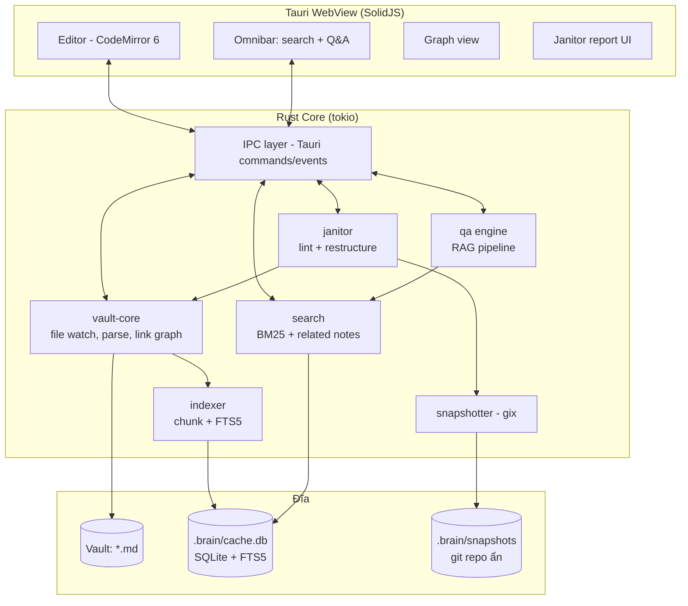
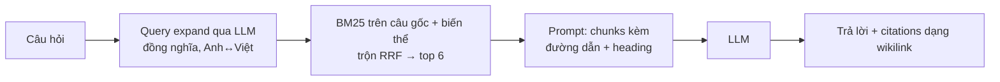

# Second Brain — Thiết kế kiến trúc

> Một app quản lý tri thức local-first giống Obsidian, viết bằng Rust, với 3 điểm khác biệt:
> **(1)** Edit + Search tích hợp sâu thành một trải nghiệm duy nhất, **(2)** Hỏi–đáp (RAG) trực tiếp trên vault, **(3)** "Janitor" — daemon tự lint & tái cấu trúc wiki hằng đêm.

---

## 1. Mục tiêu & Nguyên tắc

| Nguyên tắc | Ý nghĩa |
|---|---|
| **Local-first** | Vault = thư mục Markdown thuần trên đĩa. Không lock-in, không server bắt buộc. Mọi index/cache đều tái tạo được từ file gốc. |
| **File là nguồn chân lý** | App không bao giờ sở hữu dữ liệu. Sửa file bằng editor ngoài → app tự đồng bộ. |
| **Nhanh & tinh gọn** | Mở vault 10.000 note < 1s, search-as-you-type < 10ms, RAM idle < 150MB. Rust core, không Electron. |
| **Tự động nhưng an toàn** | Janitor chỉ restructure khi có snapshot (git) để rollback; mọi thay đổi có report, có undo. |
| **Tương thích Obsidian** | Đọc/ghi đúng cú pháp Obsidian: `[[wikilink]]`, `![[embed]]`, `[[note#heading]]`, `[[note^block]]`, YAML frontmatter, tags, callouts. Người dùng có thể mở cùng vault bằng cả 2 app. |

**Non-goals (v1):** mobile app, real-time collab, plugin ecosystem như Obsidian (chỉ có API mở để tính sau), canvas.

---

## 2. Lựa chọn Stack

### 2.1 Shell & UI

| Phương án | Ưu | Nhược | Kết luận |
|---|---|---|---|
| **Tauri 2 + SolidJS + CodeMirror 6** | Editor Markdown trưởng thành nhất (CM6 là nền của live-preview kiểu Obsidian); binary ~10MB; toàn bộ logic nặng nằm ở Rust | Vẫn có lớp WebView | ✅ **Chọn** |
| egui / iced (thuần Rust) | 100% native | Text editing phức tạp (IME, live preview, rich decorations) là điểm yếu chí mạng; tự viết editor Markdown ngang CM6 tốn ~1 năm | ❌ |
| gpui (Zed) | Hiệu năng đỉnh | API chưa ổn định, tài liệu mỏng | ❌ (theo dõi cho v2) |

> **Ranh giới rõ ràng:** WebView chỉ làm *rendering + input*. Parse, index, search, graph, RAG, file-watch, janitor — tất cả ở Rust. IPC qua Tauri commands + events (JSON, và raw channel cho payload lớn).

### 2.2 Rust core — crates chính

| Việc | Crate |
|---|---|
| Parse Markdown + wikilink | `markdown-rs` hoặc `pulldown-cmark` + extension tự viết cho `[[...]]`, `^block`, callout |
| Full-text search | SQLite FTS5 (BM25, tokenizer `unicode61`) — đủ nhanh, không thêm dep |
| Metadata cache | `rusqlite` (SQLite, WAL mode) |
| File watching | `notify` + debounce |
| LLM | Shell-out sang Claude Code CLI headless / Codex CLI (`tokio::process`) + HTTP client dự phòng |
| Git snapshot | `gix` (gitoxide) |
| Scheduler | `tokio` + `tokio-cron-scheduler` |

---

## 3. Kiến trúc tổng thể



**Cargo workspace:**

```
second-brain/
├── crates/
│   ├── vault-core/      # mô hình vault, watcher, parser, link graph
│   ├── indexer/         # incremental indexing: chunk + FTS5
│   ├── search/          # BM25 search, query parser
│   ├── qa/              # RAG: retrieve → generate + citations
│   ├── janitor/         # rule engine lint + restructure planner/executor
│   └── ipc-types/       # struct chia sẻ (serde) giữa core và UI
├── src-tauri/           # Tauri shell, wiring, scheduler
└── ui/                  # SolidJS + CodeMirror 6
```

---

## 4. vault-core — Mô hình dữ liệu

### 4.1 Vault trên đĩa

```
my-vault/
├── .brain/              # mọi thứ app sinh ra, gitignore-able, xóa được
│   ├── cache.db         # SQLite: notes, links, tags, chunk + FTS5, janitor log
│   ├── snapshots/       # bare git repo cho janitor rollback
│   └── config.toml      # cấu hình vault (rules janitor, lịch chạy)
├── notes/...            # Markdown của người dùng, cấu trúc tự do
└── attachments/
```

### 4.2 Schema SQLite (rút gọn)

```sql
CREATE TABLE note (
  id INTEGER PRIMARY KEY,
  path TEXT UNIQUE NOT NULL,        -- tương đối với vault root
  title TEXT NOT NULL,
  frontmatter JSON,
  mtime INTEGER, size INTEGER,
  content_hash BLOB                 -- blake3, để index tăng dần
);

CREATE TABLE link (                 -- đồ thị wikilink
  src_note INTEGER REFERENCES note(id),
  target_path TEXT,                 -- giữ text gốc; resolve lazy
  target_note INTEGER,              -- NULL = broken link
  kind TEXT,                        -- wiki | embed | heading | block | md
  src_offset INTEGER                -- vị trí byte để rewrite khi rename
);

CREATE TABLE chunk (                -- đơn vị index cho search & RAG
  id INTEGER PRIMARY KEY,
  note_id INTEGER REFERENCES note(id),
  heading_path TEXT,                -- "Rust > Ownership > Borrowing"
  start_line INTEGER, end_line INTEGER,
  text TEXT,
  text_hash BLOB                    -- bỏ qua chunk không đổi khi re-index
);

CREATE VIRTUAL TABLE chunk_fts USING fts5(
  text, content='chunk', content_rowid='id', tokenize='unicode61'
);

CREATE TABLE janitor_run (...);     -- xem §8
CREATE TABLE janitor_action (...);
```

### 4.3 Luồng đồng bộ (watcher)

```
notify event ──debounce 200ms──▶ hash file
     │ hash đổi?
     ▼
parse (markdown AST + frontmatter + wikilinks)
     ▼
transaction: cập nhật note/link/chunk
     ▼
trigger FTS5 tự re-index chunk đổi ──▶ emit event "note-updated" → UI
```

- **Incremental theo chunk:** chunk có `text_hash` không đổi thì không ghi lại → sửa 1 dòng trong note 5.000 từ chỉ đụng đúng 1 chunk.
- Cold start: quét toàn vault song song bằng `rayon`; 10k note mục tiêu < 5s lần đầu, < 1s các lần sau (so hash).

---

## 5. Editor — "Edit và Search tích hợp sâu"

Editor không chỉ là chỗ gõ chữ; nó là **client trực tiếp của search index**. Các tích hợp cụ thể:

1. **Live preview kiểu Obsidian** — CodeMirror 6 decorations: cú pháp Markdown ẩn/hiện theo vị trí con trỏ, render inline (bold, link, callout, ảnh, LaTeX qua KaTeX).
2. **`[[` autocomplete** — gõ `[[` gợi ý note theo fuzzy title.
3. **Backlink & unlinked mentions panel** — panel phải hiển thị cả backlink tường minh lẫn *unlinked mentions* (tên note xuất hiện dạng plain text, tìm bằng FTS5 phrase query) với nút "link hóa" một chạm.
4. **Related notes sidebar** — suy ra từ chính graph vault: tag chung, cùng link tới một note, cùng được một note nhắc tới, cộng thêm khớp từ khóa tiêu đề. Thuần SQL nên chạy trong vài ms mỗi lần lưu; note đã link trực tiếp bị loại vì đã nằm ở panel backlink.
5. **Search-and-edit toàn vault** — kết quả search hiển thị dạng snippet *có thể sửa trực tiếp trong panel kết quả* (mỗi snippet là một CM6 editor mini bind vào đúng dòng của file), giống "search & replace có não".
6. **Rename = refactor** — đổi tên/di chuyển note → core rewrite mọi wikilink trỏ tới (dùng `link.src_offset`), atomic trong 1 transaction + 1 snapshot.

---

## 6. Search — từ khóa

**Omnibar một ô duy nhất** (Ctrl+K) với 3 chế độ, phân biệt bằng cú pháp:

| Input | Chế độ | Engine |
|---|---|---|
| `rust ownership` | Search từ khóa | BM25 (FTS5, tokenizer `unicode61`) |
| `path:daily/ tag:#work "exact phrase"` | Query có toán tử | query parser mở rộng: `tag:`, `path:`, `title:`, `before:/after:` (frontmatter date) |
| `? tại sao mình chọn tokio thay vì async-std` | **Hỏi đáp** (prefix `?`) | RAG pipeline (§7) |

- Search-as-you-type đồng bộ: BM25 trả về <10ms nên gõ tới đâu kết quả tới đó, không có nhịp thứ hai để chờ.
- **Vì sao không semantic:** embedding local (ONNX ~110MB, ~300MB RAM) đánh đổi bằng CPU chạy nền đúng lúc đang gõ — trải nghiệm edit được ưu tiên hơn. Ngữ nghĩa vẫn còn ở tầng Q&A, nơi LLM mở rộng truy vấn (§7).
- Mọi kết quả đều có preview snippet + highlight, Enter mở đúng dòng.

---

## 7. Q&A — RAG trên vault



- **Citations bắt buộc:** câu trả lời chỉ được dựa trên chunk cung cấp; mỗi ý kèm `[[note#heading]]` bấm được. Không tìm thấy → nói thẳng "vault chưa có thông tin này".
- **LLM qua agent CLI có sẵn** (trait `LlmProvider`): mặc định shell-out sang **Claude Code CLI headless** (`claude -p "<prompt>" --output-format json`) hoặc **Codex CLI** (`codex exec`) — tận dụng subscription/đăng nhập sẵn có của người dùng, app không cần quản lý API key. Provider phát hiện tự động CLI nào có trên PATH; vẫn chừa backend HTTP (OpenAI-compatible) làm phương án phụ. Cấu hình per-vault trong `config.toml`.
- **Privacy mặc định:** chỉ đưa chunks được retrieve vào prompt, không gửi cả vault; CLI được gọi với working dir trỏ vào thư mục tạm (không phải vault) để tránh agent tự đọc file ngoài phạm vi.
- Chat có bộ nhớ phiên; câu trả lời hay có nút **"Lưu thành note"** (tự đặt vào folder do janitor gợi ý).

---

## 8. Janitor — Tự lint & tái cấu trúc hằng đêm ⭐

Điểm khác biệt lớn nhất, và cũng rủi ro nhất → thiết kế xoay quanh **an toàn**.

### 8.1 Nguyên tắc an toàn (không thương lượng)

1. **Snapshot trước mọi lần chạy:** commit toàn vault vào git repo ẩn (`.brain/snapshots`) → rollback 1 lệnh, giữ 30 snapshot gần nhất.
2. **Plan → (Approve) → Execute:** janitor luôn sinh *plan* (danh sách action + lý do) trước. Mỗi rule có mức tự trị riêng:
   - `auto` — làm luôn, ghi log (mặc định cho action không phá hủy: sửa broken link do rename, format frontmatter)
   - `propose` — làm nhưng chờ duyệt trong report sáng hôm sau, có nút revert từng action (mặc định cho: di chuyển file, đổi tên)
   - `suggest` — chỉ hiện gợi ý, không tự làm (mặc định cho: merge note trùng, xóa)
3. **Không bao giờ xóa nội dung** — "xóa" = chuyển vào `.brain/trash/` giữ 90 ngày.
4. **Di chuyển file = refactor:** mọi move/rename đi qua cùng đường rewrite-link như §5.6 — không bao giờ để lại broken link do chính janitor gây ra.
5. **Bỏ qua khi có thay đổi chưa ổn định:** file được sửa < 24h không bị restructure (tránh giật thảm dưới chân người dùng).

### 8.2 Rule engine — hai tầng

**Tầng 1 — Deterministic lints (thuần Rust, không cần LLM, chạy được mọi đêm):**

| Rule | Hành động mặc định |
|---|---|
| Broken wikilink | `propose`: sửa nếu tìm được đích fuzzy-match duy nhất, ngược lại đưa vào report |
| Orphan note (không link vào/ra) | `suggest`: gợi ý note nên link tới (related notes §5.4) |
| Duplicate/near-duplicate (MinHash trên nội dung) | `suggest`: merge |
| Frontmatter thiếu/sai schema (định nghĩa trong `config.toml`) | `auto`: bổ sung field mặc định |
| Naming convention (regex per-folder) | `propose`: rename |
| Attachment mồ côi | `propose`: chuyển vào trash |
| Tag gần trùng (`#Work` vs `#work`) | `propose`: hợp nhất |
| Note quá lớn (> ngưỡng) | `suggest`: tách theo heading |
| Empty note / stub > 30 ngày | `suggest`: xóa hoặc merge |

**Tầng 2 — LLM (tùy chọn bật, chạy sau tầng 1):**

- **Sinh/ cập nhật MOC** (Map of Content): mỗi folder ≥ 5 note có `_index.md` tự sinh — danh sách note nhóm theo chủ đề, LLM viết mô tả 1 dòng. File đánh dấu `generated: true` trong frontmatter, phần người dùng viết tay nằm trên marker `<!-- brain:begin-generated -->` không bao giờ bị ghi đè.
- **Guardrails:** tối đa 3 MOC mỗi lần chạy; MOC còn tươi (<7 ngày) thì bỏ qua; mọi đề xuất **luôn ở mức `propose`** — user duyệt trong report.
- *Đề xuất di chuyển note giữa các folder từng nằm ở tầng này, dựa trên embedding; đã bỏ cùng với semantic search (§6).*

### 8.3 Vòng đời một đêm

```
02:00 ──▶ snapshot (git commit)
      ──▶ tầng 1: lint pass → actions theo mức tự trị
      ──▶ tầng 2 (nếu bật): LLM sinh MOC → validate guardrails → apply mức `propose`
      ──▶ re-index phần bị ảnh hưởng
      ──▶ ghi janitor_run + sinh "Morning Report"
Sáng ──▶ user mở app: banner report — mỗi action có [Giữ] [Hoàn tác] [Luôn cho phép rule này]
```

- Chạy bằng scheduler trong app (nếu app đang mở) **hoặc** headless: `brain janitor --vault <path>` qua cron/Task Scheduler — core tách khỏi UI nên CLI dùng chung crates.
- Nút "Luôn cho phép" nâng rule từ `propose` → `auto` dần dần: janitor **học mức tin tưởng** từ hành vi duyệt của người dùng.

---

## 9. IPC & Hiệu năng

- Tauri commands (request/response) cho hành động; Tauri events (push) cho `note-updated`, `index-progress`, `janitor-report`.
- Payload lớn (kết quả search, graph data) → raw `tauri::ipc::Channel` thay vì JSON string để tránh serialize kép.
- **Ngân sách hiệu năng (10k notes, ~50MB text):**

| Chỉ số | Mục tiêu |
|---|---|
| Cold start (index sẵn) | < 1s |
| Full re-index | < 30s (parse + FTS5 là nút cổ chai) |
| Keystroke → decoration | < 16ms |
| BM25 search | < 10ms |
| Related notes panel | < 20ms |
| RAM idle | < 150MB |

---

## 10. Roadmap

| Milestone | Nội dung | Tiêu chí xong |
|---|---|---|
| **M0 — Core vault** (3–4 tuần) | vault-core: parser, watcher, SQLite cache, link graph, CLI `brain index/query` | Index vault Obsidian thật, query backlink đúng |
| **M1 — App đọc/sửa** (4–6 tuần) | Tauri shell, CM6 live preview, file tree, wikilink autocomplete, rename-refactor | Dùng thay Obsidian cho việc đọc + sửa cơ bản |
| **M2 — Search** (2–3 tuần) | FTS5/BM25, omnibar, backlinks/unlinked mentions, related notes | Search < 10ms, unlinked mention chính xác |
| **M3 — Q&A** (2–3 tuần) | RAG pipeline, citations, provider Claude + local | Trả lời có citation đúng, từ chối khi thiếu dữ liệu |
| **M4 — Janitor tầng 1** (3 tuần) | Snapshot, rule engine deterministic, morning report, CLI headless | Chạy 7 đêm liên tục trên vault thật không mất dữ liệu |
| **M5 — Janitor tầng 2** (3–4 tuần) | MOC generation qua LLM, trust learning | Plan pass guardrails, user duyệt được từng action |
| **M6 — Polish** | Graph view, themes, command palette, settings UI, installer | — |

**Rủi ro chính & đối sách:**
- *Editor live-preview khó nhất dự án* → dựa tối đa vào hệ sinh thái CM6 (tham khảo các plugin live-preview mã nguồn mở), làm sớm ở M1.
- *Janitor phá vault* → git snapshot + trash + guardrails + autonomy levels (§8.1); M4 phải "đóng đinh" an toàn trước khi cho LLM đụng vào cấu trúc ở M5.
- *Search kém "thông minh" khi không có semantic* → bù bằng reasoning search ở tầng Q&A (LLM mở rộng truy vấn, §7) và related notes suy từ graph (§5.4); đổi lại app không bao giờ tốn CPU/RAM nền trong lúc gõ.
